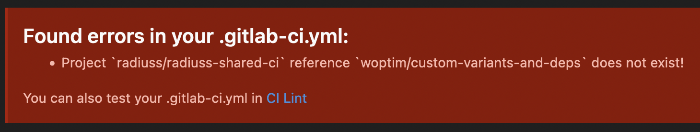

.. ##
.. ## Copyright (c) 2022, Lawrence Livermore National Security, LLC and
.. ## other RADIUSS Project Developers. See the top-level COPYRIGHT file for details.
.. ##
.. ## SPDX-License-Identifier: (MIT)
.. ##

.. _dev_common_issues-label:

******
How To
******

===================================================================
Project *radiuss/radiuss-shared-ci* reference [...] does not exist!
===================================================================

If you are attemping to use a specific reference in ``radiuss-shared-ci``, make
sure this reference has been mirrored on LC GitLab: be sure to create a PR on
GitHub so that the mirroring happens.

This error may arise when developing on a new branch in ``radiuss-shared-ci``,
The development repository is on GitHub.com but in the CI configuration we
recommend that projects point to the LC GitLab clone.
