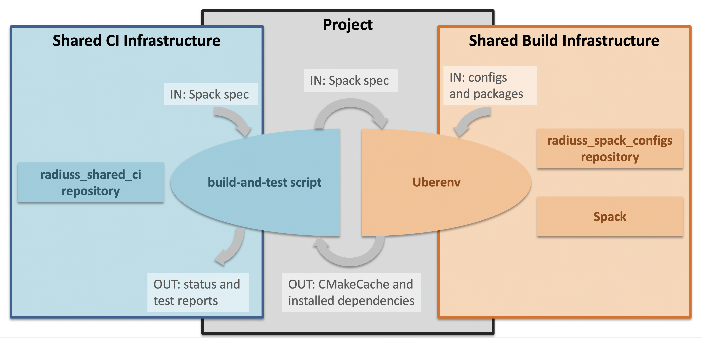

.. ##
.. ## Copyright (c) 2022, Lawrence Livermore National Security, LLC and
.. ## other RADIUSS Project Developers. See the top-level COPYRIGHT file for details.
.. ##
.. ## SPDX-License-Identifier: (MIT)
.. ##

.. _build_and_test-label:

******************************************************
Build and test your code using your usual workflow
******************************************************

   We need the project to be buildable from the CMake cached configuration
   file. A build script will be required for CI.

The second step in adopting RADIUSS CI infrastructure is to make sure your
project can be built using the configuration file generated by Spack. Other
than that, building and testing your code can follow your usual development
workflow.

After Spack has generated the configuration file, it is no longer involved in
the build and test process. Using the configuration file will make sure the
build uses the Spack installed dependencies and the options specified by the
spec.

==============================================
Using configuration files to build the project
==============================================

(CMake) configuration files are specific to each machine and toolchain. With
CMake, the usage is as follows:

.. code-block:: bash

  $ mkdir build && cd build
  $ cmake -C  <path-to>/<configuration>.cmake ..
  $ cmake --build -j .
  $ ctest --output-on-failure -T test

In the end, this should not be a major change in developer workflow for a CMake
project.

.. _write-ci-script:

=======================
Writing a script for CI
=======================

The CI expects a script that:

* is parametrized by the variable ``SPEC`` which is used to prescribe a Spack
  spec with the project name stripped out.
* executes the following project build and test processes:

    #. install dependencies and generate CMake configuration file
       (using Spack, and optionally Uberenv, as described earlier)
    #. configure a build with the configuration file and build the project
       source code
    #. run the project tests

The script should be runable outside of GitLab CI to make it easier to test and
debug. For example:

.. code-block:: bash

  $ SPEC="%clang@9.0.0 +cuda" scripts/gitlab/build_and_test.sh

.. note::
  It is recommended to make the CI scripts usable outside CI context since, by
  definition, it is vetted to work correctly by the CI. It also ensures that
  this script is usable in interactive mode, making it easier to test. This is
  why we document it in the build part rather than the CI part.

Umpire, RAJA, CHAI, MFEM each have their own script that you could use as a
starting point and adapt to your project. These projects use Uberenv to drive
Spack. Umpire, RAJA and CHAI share Spack configuration files and packages in
`radiuss-spack-configs`_ in order to build and test with the same toolchains
and configurations.

=========
Debugging
=========

In the workflow described above, there are 4 levels of scripts to control the
build of a package. From the lowest to the highest level:

* The *build system* is controlled by a configuration file (whether generated
  by Spack or not).
* The *Spack package* is controlled by the spec provided and Spack
  configuration.
* *Uberenv* takes a spec and a json configuration file.
* A build and test script, which is a test driver. The scripts
  in Umpire and RAJA requires a spec and some other control variables.

When debugging, each level has requirements to reproduce a failing build:

* The build and test script typically runs in CI context. This means
  that it may not be designed to run outside CI. It is better if it does, and
  we try to do that in RADIUSS, but it is not guaranteed.
* Uberenv provides a turnkey way to install a project and its dependencies. It
  is usually a good way to reproduce a build on a given machine. The CI creates
  working directories in which the Uberenv install directory *may* persist, but
  it is better to reproduce in a local clone.
* Reproducing a build with ``Spack`` by itself requires a deep knowledge of
  Spack. Fortunately, Uberenv simplifies much of the complexity by encoding
  many Spack usage mechanics. We recommend that you use Uberenv to generate the
  Spack instance. Then, loading the Spack instance generated and working with
  it is relatively simple and safe.
* Going down to a project ``build system`` is also doable, especially when
  using generated configuration files. Once Spack has installed dependencies
  and generated configuration files, the latter can be used to control the
  build of the code, which should not require using Spack.

.. _radiuss-spack-configs: https://github.com/LLNL/radiuss-spack-configs
