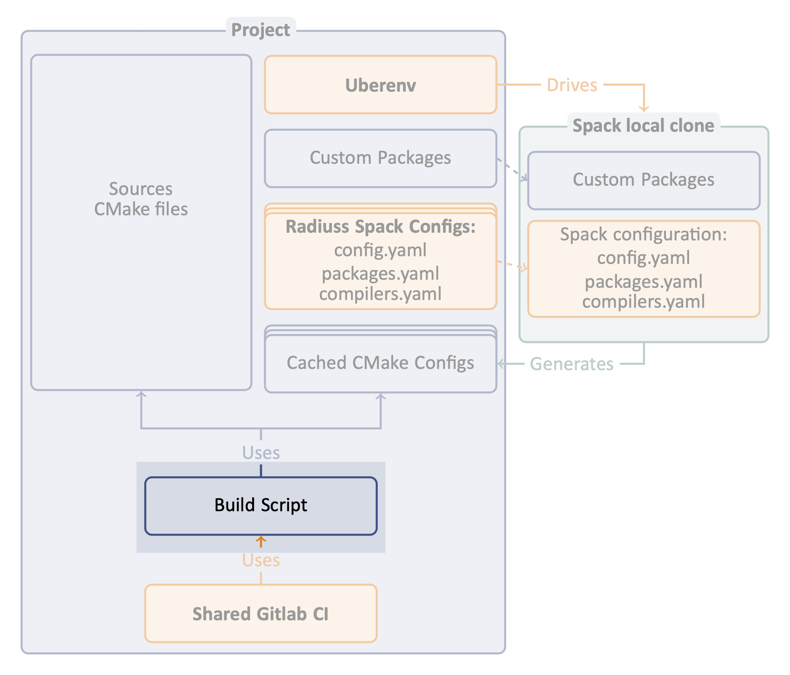

.. ##
.. ## Copyright (c) 2022, Lawrence Livermore National Security, LLC and
.. ## other RADIUSS Project Developers. See the top-level COPYRIGHT file for details.
.. ##
.. ## SPDX-License-Identifier: (MIT)
.. ##

.. _build_and_test-label:

******************************************************
Build and test your code using your usual workflow
******************************************************

The second step in adopting RADIUSS Shared CI infrastructure is to make sure
your project can be built using the configuration file generated by Spack.
Other than that, building and testing your code should follow the usual
development workflow.

Spack is no longer involved at this point. But using the configuration file
will make sure the build uses the Spack installed dependencies and the options
specified by the Spack spec.

==============================================
Using configuration files to build the project
==============================================

The (CMake) configuration files are specific to the desired machine and
toolchain. With CMake, the usage is as follows:

.. code-block:: bash

  $ mkdir build && cd build
  $ cmake -C  <path-to>/<configuration>.cmake ..
  $ cmake --build -j .
  $ ctest --output-on-failure -T test

In the end, this should not be a major change in developer workflow for
a CMake project.

.. _write-ci-script:

=======================
Writing a script for CI
=======================

The CI expects a script that:

* is named ``build-and-test.sh and lives in the directory ``scripts/gitlab`` 
  in your project Git repo.
* is parametrized by the variable ``SPEC`` which should contain a Spack spec
  with the project name stripped out.
* covers both step 1 (installation of dependencies, configuration file
  generation) and step 2 (build the project from the configuration file 
  and run your tests).

The script should therefore be callable:

.. code-block:: bash

  $ SPEC="%clang@9.0.0 +cuda" scripts/gitlab/build_and_test.sh

.. note::
  It is recommended to make the CI scripts usable outside CI context since, by
  definition, it is vetted in CI. It also ensures that this script is usable in
  interactive mode, making it easier to test. This is why we document it in the
  build part rather than the CI part.

Umpire, RAJA, CHAI, MFEM each have their own script you could easily adapt. All
these projects use Uberenv to drive Spack. Umpire, RAJA and CHAI share the
Spack configuration files in `radiuss-spack-configs`_ in order to build and
test with the same toolchains and configurations.

=========
Debugging
=========

In the workflow described above, there are 4 levels of scripts to control the
build of a package. From the lower to the higher level:

* The *build system* is controlled by a configuration file (whether generated 
  by Spack or not).
* The *Spack package* is controlled by the spec provided and spack 
  configuration.
* *Uberenv* takes a spec and a json configuration file.
* A ``build-and-test.sh`` script also sometimes called test driver. The one 
  in Umpire and RAJA requires a spec and some other control variables.

Now, when it comes to debugging, each level has some requirements to reproduce
a failing build:

* The ``build-and-test.sh`` script typically runs in CI context. This means 
  that it may not be designed to run outside CI. It is better if it does, and 
  we try to do that in RADIUSS, but it is not guaranteed. Uberenv provides a 
  turnkey way to install the project and its dependencies. It is usually a good
  way to reproduce a build on a given machine. The CI creates working 
  directories in which the Uberenv install directory *may* 
  persist, but it is better to reproduce in a local clone.
* Reproducing a build with ``Spack`` by itself requires a deep knowledge of it.
  Fortunately, Uberenv simplifies much of the complexity by encoding many 
  Spack usage mechanics. We recommend that you use Uberenv to generate 
  the Spack instance. Then, loading the spack instance generated and working 
  with it is relatively simple and safe.
* Going down to the ``build system`` is also doable, especially when using the
  generated configuration files. Once spack has installed the dependencies and
  generated the configuration files, the latter can be used to control the
  build of the code and this should not require using Spack.

.. _radiuss-spack-configs: https://github.com/LLNL/radiuss-spack-configs
