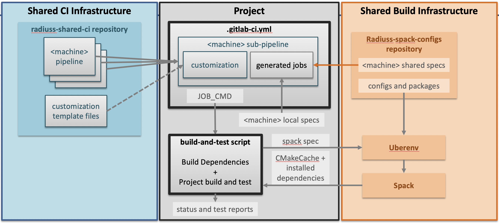

.. ##
.. ## Copyright (c) 2022-25, Lawrence Livermore National Security, LLC and
.. ## other RADIUSS Project Developers. See the top-level COPYRIGHT file for
.. ## details.
.. ##
.. ## SPDX-License-Identifier: (MIT)
.. ##

.. _user_how_to-label:

******
How To
******

This section describes how to perform various maintenance tasks once you have
the RADIUSS Shared CI framework set up for your project.

.. _update-shared-ci:

==========================
Updating RADIUSS Shared CI
==========================

Updating RADIUSS shared CI is straightforward. The Shared CI version to use is
defined by a the reference (set by the ``ref:`` section) in the remote
includes. We recommend using a variable to set this reference only once, and
then update radiuss-shared-ci easily.

.. _leverage-spack:

==============
Leverage Spack
==============

Initially, the RADIUSS Shared CI infrastructure was designed for RADIUSS
projects also using Spack to describe the toolchain and build the dependencies.
This "build infrastructure" is defined in `RADIUSS Spack Configs`_
documentation.

Spack provides a unified context to express toolchains, machine setup, and
build sequence. Spack is increasingly used to install dependency stacks of
large simulation codes.

Using RADIUSS Spack Configs allows projects to easily share the full context of
their builds.

   The Shared CI Infrastructure is project agnostic. It is tuned for
   open-source projects hosted on GitHub and willing to run CI on a GitLab
   instance. It currently only supports a handful of Livermore Computing
   machines, but more could be added without disrupting the design.

If you were to adopt the full infrastructure, setting up the build
infrastructure would be done following two steps:

1. **Use Spack to install dependencies and configure a project build.**
2. **Setup your build system so that it accepts the configuration file
   generated by Spack.**

.. _import-shared-jobs:

==================
Import shared jobs
==================

In the :ref:`add-jobs` section of the CI setup chapter, we explained how to
add jobs using a local file. Our projects using the full CI infrastructure,
including RADIUSS Spack Configs, also share a set of jobs that correspond to
toolchains they all care about.

Those jobs are defined in RADIUSS Spack Configs, which is set as a submodule in
our projects. While GitLab does not permit to include file from submodules, we
work around this by generating the jobs YAML file, merging the local
project-specific one with the shared one from the RADIUSS Spack Configs
submodule.

This translate into the addition of a new job in a stage preceeding the child
pipeline calls:

.. code-block:: yaml

   generate-job-lists:
     stage: prerequisites
     tags: [shell, oslic]
     variables:
       RADIUSS_JOBS_PATH: "scripts/radiuss-spack-configs/gitlab/radiuss-jobs"
       LOCAL_JOBS_PATH: ".gitlab/jobs"
     script:
       - cat ${RADIUSS_JOBS_PATH}/dane.yml ${LOCAL_JOBS_PATH}/dane.yml > dane-jobs.yml
       - cat ${RADIUSS_JOBS_PATH}/lassen.yml ${LOCAL_JOBS_PATH}/lassen.yml > lassen-jobs.yml
       - cat ${RADIUSS_JOBS_PATH}/corona.yml ${LOCAL_JOBS_PATH}/corona.yml > corona-jobs.yml
       - cat ${RADIUSS_JOBS_PATH}/tioga.yml ${LOCAL_JOBS_PATH}/tioga.yml > tioga-jobs.yml
     artifacts:
       paths:
         - dane-jobs.yml
         - lassen-jobs.yml
         - corona-jobs.yml
         - tioga-jobs.yml

In this same file, you will need to specify that each sub-pipeline trigger job
now "need" the ``generate-job-lists``. This is done in the ``needs`` section:

.. code-block:: yaml

   dane-build-and-test:
     variables:
       CI_MACHINE: "dane"
     needs: [dane-up-check, generate-job-lists]
     extends: [.build-and-test]

Then, the child pipeline template ``.build-and-test`` in ``.gitlab-ci.yml``
becomes:

.. code-block:: yaml

   .build-and-test:
     stage: build-and-test
     trigger:
       include:
         - local: '.gitlab/custom-jobs-and-variables.yml'
         - project: 'radiuss/radiuss-shared-ci'
           ref: '${SHARED_CI_REF}'
           file: 'pipelines/${CI_MACHINE}.yml'
         - artifact: '${CI_MACHINE}-jobs.yml'
           job: 'generate-job-lists'
       strategy: depend
       forward:
         pipeline_variables: true

Local jobs are merged with shared jobs, still allowing projects to define their
own jobs. Also, local jobs should be defined after the shared ones in the final
file to preserve the capability to override the latter if needed.

.. _complex-workflows:

=============================
Implement Complex CI Worflows
=============================

In the CI setup description, the resulting worflow gathers all the jobs withing
one stage, with jobs calling only the ``JOB_CMD`` one-line command.

Restricting the job command to a one-liner is required because we append it to
an allocation call. In our opinion, it is not restrictive because it is a good
practice to define your scripts outside the CI YAML files.

However, it may appear restrictive to only allow one-stage pipelines.

In facts, the RADIUSS Shared CI defines 3 stages for you to use. They are named
``jobs-stage-<1,2,3>``. They stand between the ``allocate-resources`` and the
``release-resources`` stages, which means that jobs will run within the shared
allocation as long as they inherit from the shared job template (``extends:
.job_on_<machine>``).

In your local jobs definition, you may pick the stage with the key
``stages: jobs-stage-<1,2,3>``. This will override the default value set in the
job template (``jobs-stage-1``).

It is also possible to go further in the customization and override the list of
stages to add more. We only warn you that a good understanding of the Shared CI
implementation is required before overridding it.

.. warning::
   GitLab YAML syntax allows you to override any section previously defined.
   This opens to door to deep customization of the Shared CI implementation.
   However it requires a good understanding of how the Shared CI works. In
   general, we advise you to start by submitting a feature requests on GitHub:
   we are open to suggestions and can help with your customization needs.

.. _RADIUSS Spack Configs: https://radiuss-spack-configs.readthedocs.io/en/latest/index.html
.. _radiuss-spack-configs: https://github.com/LLNL/radiuss-spack-configs
.. _Uberenv: https://github.com/LLNL/uberenv
.. _Spack: https://github.com/spack/spack
