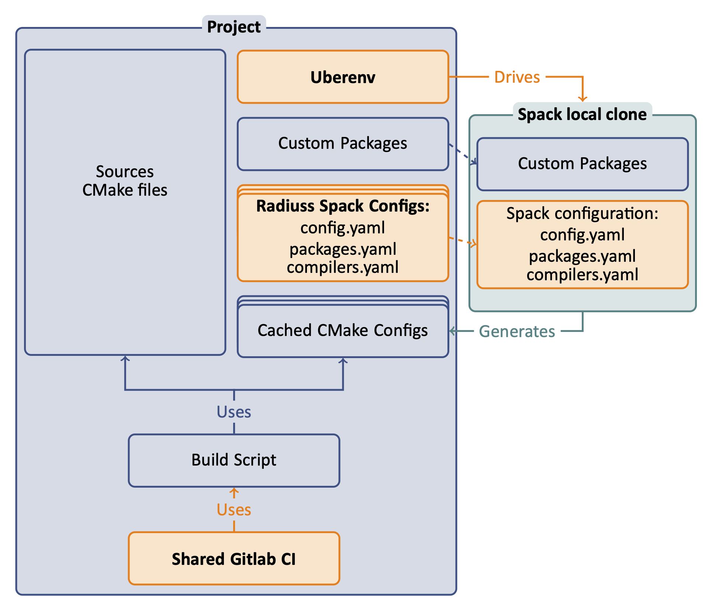

.. ##
.. ## Copyright (c) 2022, Lawrence Livermore National Security, LLC and
.. ## other RADIUSS Project Developers. See the top-level COPYRIGHT file for details.
.. ##
.. ## SPDX-License-Identifier: (MIT)
.. ##

.. _user_guide-label:

##########
User Guide
##########

We designed an automated *CI infrastructure based on GitLab* that we meant to be
universal enough to be shared among RADIUSS projects. This infrastructure
involves *using Spack to setup the project dependencies and generate a
configuration file*. This allows projects to easily *share the full context of
their builds*. The project is then built and tested as usual and most of *the
CI infrastructure is shared* to avoid duplication and ease the maintenance.

We split the design in three steps necessary to adopt RADIUSS CI methodology.

.. toctree::
   :maxdepth: 2

   use_spack
   build_and_test
   setup_ci

We also provide an "How To" section.

.. toctree::
   :maxdepth: 2

   how_to

.. warning::
   Due to its GitLab CI sharing goal, Radiuss Shared CI is meant to live on LC
   GitLab instance. The main repo, hosted on GitHub for accessibility and
   visibility, is mirrored on LC GitLab. To include files from Radiuss-CI, we
   recommend pointing to the mirror repo on GitLab rather than the GitHub one.
   We only document that option.
