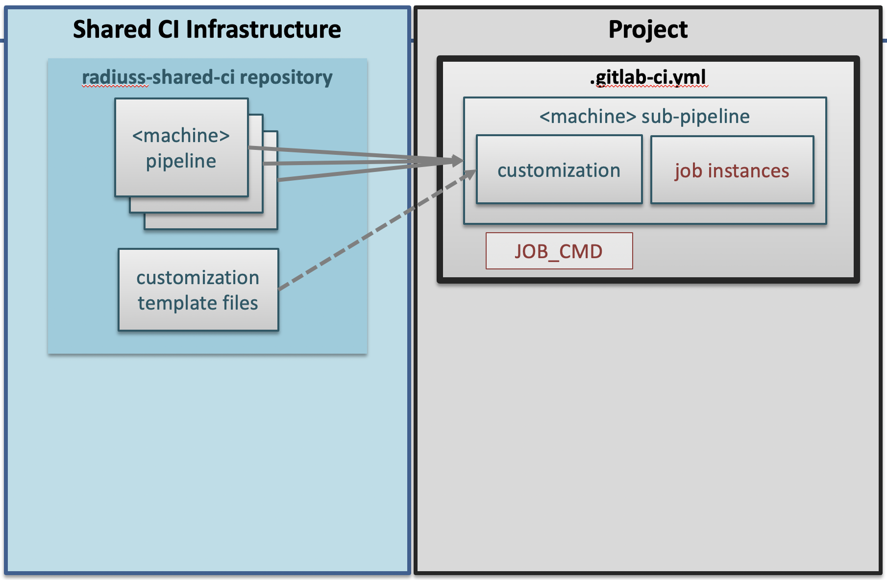

.. ##
.. ## Copyright (c) 2022-23, Lawrence Livermore National Security, LLC and
.. ## other RADIUSS Project Developers. See the top-level COPYRIGHT file for
.. ## details.
.. ##
.. ## SPDX-License-Identifier: (MIT)
.. ##

.. _user_guide-label:

##########
User Guide
##########

LLNL open-source projects are prevalently hosted on GitHub. However, for those
meant to run on Livermore Computing (LC) systems, testing on LC GitLab instance
on an automated manner is paramount.

The RADIUSS Shared CI project provides a *templated CI infrastructure for
GitLab* that we intend to be sufficiently flexible and general to be adopted
and shared by any LLNL open-source projects hosted on GitHub.

The infrustructure is project-agnostic. Each machine we support has a templated
pipeline ready for use. Users only need to add jobs for machines of interest
and set some variables according to their needs.

Projects using the RADIUSS Shared CI infrastructure keep control other their
build and test process. The pre-requisite being that this process can be
invoked through a single command line.

A project is then built and tested as usual and *most of the CI infrastructure
is shared* to reduce duplicated effort and ease maintenance for individual
projects.

   RADIUSS CI infrastructure provides a templated CI infrastructure. Pipeline
   files should be included remotely to the projects CI configuration, while
   templated configuration files should be copied over and filled.

The figure illustrates the setup of a project using the RADIUSS Shared CI
Infrastructure.

The infrastructure is hosted on GitHub and mirrored on the Livermore Computing
(LC) CZ GitLab instance. A project points to that GitLab mirror to access
RADIUSS Shared CI configurations.

In this documentation, we will describe how to set up RADIUSS Shared CI for
your project.

.. toctree::
   :maxdepth: 2

   setup_ci

We also provide "How To" sections to perform various usage tasks.

.. toctree::
   :maxdepth: 2

   how_to

.. warning::
   Due to its GitLab CI sharing goal, radiuss-shared-ci is meant to live on
   the LC GitLab instance. The main repo is hosted on GitHub for accessibility
   and visibility and is mirrored on LC GitLab. To include files from
   radiuss-shared-ci, we recommend pointing to the mirror repo on GitLab rather
   than the GitHub projects. We only document that option.

.. _RADIUSS Spack Configs: https://radiuss-spack-configs.readthedocs.io/en/latest/index.html
.. _radiuss-spack-configs: https://github.com/LLNL/radiuss-spack-configs
.. _radiuss-shared-ci: https://github.com/LLNL/radiuss-shared-ci
.. _Uberenv: <https://github.com/LLNL/uberenv>
.. _Spack: <https://github.com/Spack/Spack>
