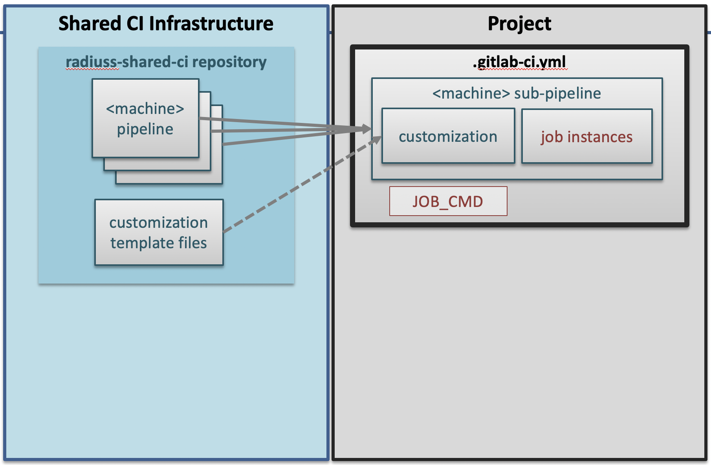
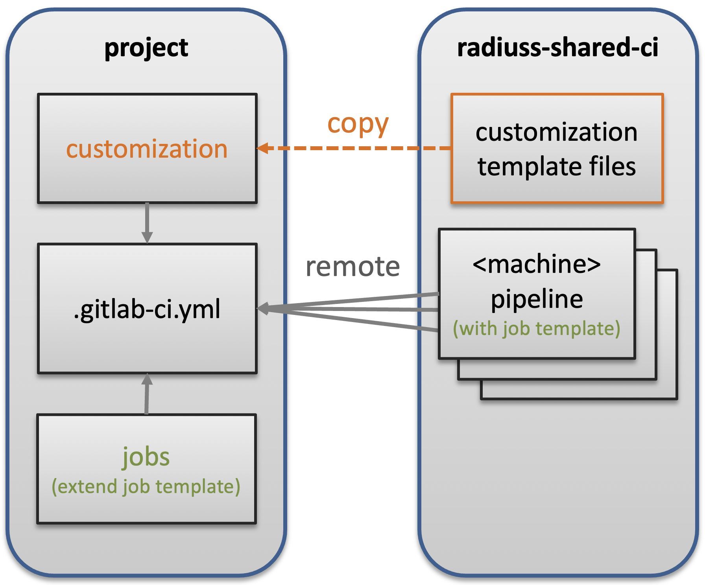

.. ##
.. ## Copyright (c) 2022-2025, Lawrence Livermore National Security, LLC and
.. ## other RADIUSS Project Developers. See the top-level COPYRIGHT file for
.. ## details.
.. ##
.. ## SPDX-License-Identifier: (MIT)
.. ##

.. _setup_ci:

************
Setup the CI
************

   The Shared CI Infrastructure is project agnostic. It is tuned for
   open-source projects hosted on GitHub and willing to run CI on a GitLab
   instance. It currently only supports a handful of Livermore Computing
   machines, but more could be added without disrupting the design.

The pre-requisite for using the RADIUSS Shared CI Infrastructure, provided that
your projects is hosted on GitHub, is that you can trigger your build and test
process with one command line.

.. warning::
   radiuss-shared-ci is meant to live on the LC GitLab instance. The main repo
   is hosted on GitHub for accessibility and visibility and is mirrored on LC
   GitLab. To include files from radiuss-shared-ci, we recommend pointing to
   the mirror repo on GitLab rather than the GitHub projects. We only document
   the former.

Strict separation between the build and test process and the CI infrastructure
greatly helps with maintenance: it is much easier to debug a standalone script,
which can be run outside CI, than when the process is encoded in the CI YAML
files.

.. note::
   In our own RADIUSS CI setups, we do not split the build and the test phases
   because it adds complexity. This typically saves us from using artifacts.
   However, we do not prevent projects from implementing more complex
   workflows. Please refer to :ref:`complex-workflows` for more details on
   multi-steps workflow with RADIUSS Shared CI.

Our RADIUSS projects typically leverage Spack to manage the installation of the
dependencies and configure the project. We describe this as a *Shared Build
Infrastructure* documented in `RADIUSS Spack Configs`_. Then, building and
testing is handled in custom scripts.

========
Overview
========

By sharing the CI definition, projects share the burden of maintaining it.

With a centralized CI configuration that is shared by projects, we create an
interface between local and shared configurations. We try to keep this
interface minimal, while allowing for project-specific customization.

Projects only need to set some variables and add CI jobs instances (inheriting
from the job template) to get the CI to work. Files in the ``customization``
directory allow for fine tuning and extensibility.

.. note::
   GitLab allows projects to include external files to configure their CI. We
   rely on this mechanism to share most of the CI configuration among projects.

==============
File structure
==============

   The RADIUSS Shared CI repository contains files that are included remotely
   as well as template files that needs to be copied over and completed. Each
   pipeline file also defines a job template (in the sense of GitLab CI YAML
   syntax) providing the core settings that your own jobs will extend.

.. _instructions:

=================
The short version
=================

The following sequence of steps and commands summarizes the process of
integrating the RADIUSS Shared CI infrastructure into your project.

.. code-block:: bash

   ### Prerequisites
   # write CI script

   ### CI Setup
   cd my_project/..
   git clone https://github.com/LLNL/radiuss-shared-ci.git
   cd my_project
   cp ../radiuss-shared-ci/customization/gitlab-ci.yml .gitlab-ci.yml
   mkdir -p .gitlab/jobs
   cp ../radiuss-shared-ci/customization/subscribed-pipelines.yml .gitlab
   cp ../radiuss-shared-ci/customization/custom-jobs-and-variables.yml .gitlab
   cp ../radiuss-shared-ci/customization/jobs/\<machine\>.yml .gitlab/jobs/<machine>.yml
   # You may use the <machine>.yml file as a starting point to add jobs.
   vim .gitlab/subscription-pipelines.yml
   # comment the jobs associated to <CI_MACHINE> you don't want.
   vim .gitlab/custom-jobs-and-variables.yml
   # set the variables according to your needs.
   vim .gitlab/jobs/<machine>.yml
   # Add jobs or override some of the shared ones.

   ### Mirroring Setup
   https://docs.gitlab.com/ee/ci/ci_cd_for_external_repos/github_integration.html#connect-with-personal-access-token

   ### Non-RADIUSS projects
   open https://lc.llnl.gov/gitlab/<group>/<project>/-/settings/ci_cd
   # Set CI/CD variable GITHUB_TOKEN to hold token with repo:status
   # permissions.

Jump to a corresponding section for details on :ref:`customize-ci`,
:ref:`add-jobs`.

====================
The detailed version
====================

Our CI implementation can be divided in four parts:

* local build-and-test script
* shared files
* customization files
* jobs

Setting up the CI consists of four corresponding steps.

Write CI Script
===============

The first step is to prepare a CI script that will be called using the
``JOB_CMD`` variable in the CI. Once you have that script, you are ready to
move on to the CI setup.

Core CI implementation
======================

Start by cloning the RADIUSS Shared CI project locally, for example next to
the project you intend to add CI to.

.. code-block:: bash

   cd my_project/..
   git clone https://github.com/LLNL/radiuss-shared-ci.git
   cd my_project

By default, GitLab expects a ``.gitlab-ci.yml`` file to interpret the CI setup.
We provide one in ``customization/gitlab-ci.yml`` that projects can copy over
(don't forget to add a ``.``). Place the file in the top-level directory of
your project.

.. code-block:: bash

   cp ../radiuss-shared-ci/customization/gitlab-ci.yml .gitlab-ci.yml

In the ``.gitlab-ci.yml`` file, there are some variables that you need to adapt
to your project. They are described in the following table:

 ========================================== ==========================================================================================================================
  Parameter                                  Description
 ========================================== ==========================================================================================================================
  ``LLNL_SERVICE_USER``                      Project specific Service User Account used in CI (optional but recommeded)
  ``CUSTOM_CI_BUILD_DIR``                    If not using a service user, where to locate the CI working directories (prevent exceeding your disk quota)
  ``GIT_SUBMODULES_STRATEGY``                Controls strategy for the clone performed by GitLab. Consider ``recursive`` if you have submodules, otherwise comment it.
  ``GITHUB_PROJECT_NAME``                    The Project name on GitHub, used to send status updates
  ``GITHUB_PROJECT_ORG``                     The Project organization on GitHub, used to send status updates
  ``JOB_CMD``                                The command that runs the build and test script. Lets you name and store that script however you like.
  ``ALWAYS_RUN_PATTERN``                     The regex pattern describing the branches that will skip the draft pull request filter test.
 ========================================== ==========================================================================================================================

.. note::
   If a variable is blank in the template file, then it does not require a
   value. If a variable has a value there (even "..."), it does require one.

.. warning::
   We strongly recommend that you set your CI to use a service user account.
   This will enable you to add users to the associated service user account
   group so that they can interact with GitLab runners to restart test
   pipelines, for example. It will also simplify permissions and allocations
   management.

Your CI is now set up to include remote files from the GitLab mirror of the
radiuss-shared-ci project.

We now need to complete the interface with the shared CI configuration.
In particular, the ``.gitlab-ci.yml`` file requires some files to be present
in your Git repository. These are described in the next few sections.

.. _customize-ci:

Customize the CI
================

We provide templates for the required customization files. You need to have a
``.gitlab`` subdirectory in the top-level of your Git repository. Then,
you can copy the template files to that directory in your repo. For example:

.. code-block:: bash

   mkdir -p .gitlab
   cp ../radiuss-shared-ci/customization/subscribed-pipelines.yml .gitlab
   cp ../radiuss-shared-ci/customization/custom-jobs-and-variables.yml .gitlab

We will now browse the files to see what changes they may require to suit your
needs.

The ``.gitlab/subscribed-pipelines.yml`` file
---------------------------------------------

In this file, you will select the machines you want to run tests on. Comment
out the jobs (sections) for machines you don't want, or don't have access to.

.. note::
   To add a new machine, please refer to :ref:`add-a-new-machine`.

The ``.gitlab/custom-jobs-and-variables.yml`` file
--------------------------------------------------

Here is a table that describes each variable present in the file. More
details can be found in the file itself.

 ========================================== ==========================================================================================================================
  Parameter                                  Description
 ========================================== ==========================================================================================================================
  ``ALLOC_NAME``                             Name of the shared allocation. Should be unique, our default should be fine.
  ``<MACHINE>_SHARED_ALLOC``                 Optional: Parameters for the shared allocation. You may extend the resource and time.
  ``<MACHINE>_JOB_ALLOC``                    Parameters for the job allocation. You may extend the resource and time within the scope of the shared allocation.
  ``PROJECT_<MACHINE>_VARIANTS``             Global variants to be added to all the shared specs.
  ``PROJECT_<MACHINE>_DEPS``                 Global dependencies to be added to all the shared specs.
 ========================================== ==========================================================================================================================

.. note::
   If a variable is blank in the template file, then it does not require a
   value. If a variable has a value there, it does require one.

You may modify to the ``.custom_job`` job that will then be included in all you
CI jobs. This can be used to `export jUnit test reports`_, for example. Changes
to that section are not mandatory.

.. _add-jobs:

Add jobs
========

We provide a template file to add jobs to each machine. You should create one
file per machine using this template. These files may be placed in your
project's ``.gitlab/jobs`` subdirectory and named ``<machine>.yml``, where
``<machine>`` is the machine name. They are required as soon as the
associated machine has been activated (uncommented) in the
``.gitlab/subscribed-pipelines`` file.

In the provided template, you may remove the variable definition, uncomment and
duplicate the example job and complete it with the required information:

* Unique job names that will appear in CI.
* Custom variables that will make that job unique.

.. warning::
   GitLab supports long and complex job names. Make sure to pick names that
   are unique so that your extra jobs do not override a shared job.

.. note::
   It is possible to import jobs from another repository. This is what we do in
   our RADIUSS projects to share some jobs and thus make sure we build with the
   same toolchains. See the dedicated How-To section for more details
   :ref:`import-shared-jobs`.

Mirroring Setup
===============

RADIUSS Shared CI is primarily intended for projects hosted on GitHub that need
to run tests on LLNL Livermore Computing (LC) systems through the LC GitLab
instance. GitLab provides a mirroring feature with GitHub integration that will
automate the synchronization of local source with the remote GitHub repository.

The mirroring setup is described in detail in `GitLab documentation`_:

Non-RADIUSS Projects
====================

RADIUSS Shared CI features a customized status report mechanism that reports to
to GitHub when a machine is down, making it impossible to run the pipeline.
This prevent users from having to connect to GitLab to find out.

If your project hasn't been mirrored within the Radiuss group on LC GitLab,
this feature will only work after you create a GitHub token with
``repo:status`` permissions, and registering it as a CI/CD variable named
``GITHUB_TOKEN`` in the project (or the group) on GitLab.

Visit ``https://lc.llnl.gov/gitlab/<group>/<project>/-/settings/ci_cd`` to
create the variable once the token has been generated on GitHub.

.. _Radiuss Shared CI: https://radiuss-shared-ci.readthedocs.io/en/latest/index.html
.. _export jUnit test reports: https://github.com/LLNL/Umpire/blob/develop/.gitlab/custom-jobs-and-variables.yml
.. _sharing spack configuration files: https://github.com/LLNL/radiuss-spack-configs
.. _RADIUSS Spack Configs: https://radiuss-spack-configs.readthedocs.io/en/latest/index.html
.. _GitLab documentation: https://docs.gitlab.com/ee/ci/ci_cd_for_external_repos/github_integration.html#connect-with-personal-access-token
