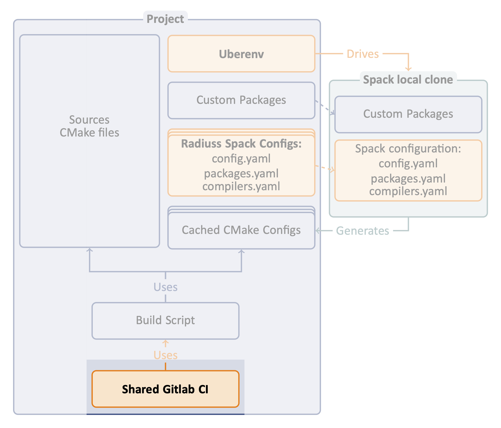

.. ##
.. ## Copyright (c) 2022, Lawrence Livermore National Security, LLC and
.. ## other RADIUSS Project Developers. See the top-level COPYRIGHT file for details.
.. ##
.. ## SPDX-License-Identifier: (MIT)
.. ##

.. _setup_ci-label:

**************************************
Setup the CI using the shared template
**************************************

The third step in adopting RADIUSS CI infrastructure is to setup the CI.

Once you put in the effort to adopt the first two steps, you should be able to
benefit from the shared CI infrastructure. In very complex scenario, you will
always be able to use the template as a starting point for a custom
implementation.

By sharing the CI definition, projects share the burden of maintaining it. In
addition, with our shared CI, they also share a core set of toolchains (spack
specs) to ensure that they keep running tests with similar configurations.

=================
Radiuss Shared CI
=================

Sharing the CI framework started with `sharing spack configuration files`_, a
method manage Spack and use it to generate CMake configuration files and a
``build-and-test`` script with that has the same imputs across projects. We
will now also share most of the CI implementation itself.

By externalizing the CI configuration, we create the need for an interface.
We try to keep this interface minimalistic, while allowing customization.

.. note::
   GitLab allows projects to include external files to configure their CI. We
   rely on this mechanism to share most of the CI configuration among projects.

The short version
=================

.. code-block:: bash

   ### Prerequisites
   cd my_project
   mkdir -p scripts/gitlab
   vim scripts/gitlab/build-and-test
   # write CI script

   ### CI Setup
   cd my_project/..
   git clone https://github.com/LLNL/radiuss-shared-ci.git
   cd my_project
   cp ../radiuss-shared-ci/customization/gitlab-ci.yml .gitlab-ci.yml
   mkdir -p .gitlab
   cp ../radiuss-shared-ci/customization/custom-*.yml .gitlab
   cp ../radiuss-shared-ci/example-extra-jobs/*-extra.yml .gitlab
   vim .gitlab/custom-*.yml
   # customize CI
   vim .gitlab/*-extra.yml
   # edit extra jobs

Jump to the corresponding section to deal with :ref:`customize-ci`,
:ref:`edit-extra-jobs` and :ref:`write-ci-script`.

The detailed version
====================

Our CI implementation can be divided in four parts:

* local build-and-test script
* shared files
* customization files
* extra jobs

Setting up the CI will basically consist in four corresponding phases.

Write CI Script
---------------

The very first step is to provide a CI script. You should already have one
after completing `write-ci-script`_ at Step 2.

Once you have that script, you can move on to the CI setup.

Core CI implementation
----------------------

Start by cloning the project locally, for example next to the project you intend
to add CI to.

.. code-block:: bash

   cd my_project/..
   git clone https://github.com/LLNL/radiuss-shared-ci.git
   cd my_project

By default, GitLab expects a ``.gitlab-ci-yml`` file to interpret the CI setup.
We provide one in ``customization/gitlab-ci.yml`` that projects can copy-paste,
just be sure to place it at the root of your project, with a dot (``.``) at the
beginning of the name.

.. code-block:: bash

   cp ../radiuss-shared-ci/customization/gitlab-ci.yml .gitlab-ci.yml

Your CI is now setup to include remote files from the GitLab mirror of
Radiuss-Shared-CI.

We now have to complete the interface with the shared CI config. Indeed,
``.gitlab-ci.yml`` also expects some files to be present locally. Those are the
next steps.

.. _customize-ci:

Customize CI
------------

We provide templates for the required customization files. We need to copy
them in the ``.gitlab`` directory.

.. code-block:: bash

   mkdir -p .gitlab
   cp ../radiuss-shared-ci/customization/custom-*.yml .gitlab

We will now browse the files to see what changes they may require to suit your
needs.

``.gitlab/custom-pipelines.yml``
^^^^^^^^^^^^^^^^^^^^^^^^^^^^^^^^

In this file, you will select the machines you want to run tests on. Comment
the jobs (sections) corresponding to machines you don't want, or don't have
access to.

``.gitlab/custom-jobs.yml``
^^^^^^^^^^^^^^^^^^^^^^^^^^^

No change is strictly required to get started here.

In this file, you may add configuration to the ``.custom_build_and_test`` job
that will then be included to all you CI jobs. This can be used for example to
`export jUnit test reports`_.

``.gitlab/custom-variables.yml``
^^^^^^^^^^^^^^^^^^^^^^^^^^^^^^^^

We should now have a look at ``.gitlab/custom-variables.yml``. Here is a table
to describe each variable present in the file. Some more details can be found
in the file itself.

 ========================================== ==========================================================================================================================
  Parameter                                  Description
 ========================================== ==========================================================================================================================
  ``LLNL_SERVICE_USER``                      Service Account used in CI
  ``CUSTOM_CI_BUILD_DIR``                    Where to locate build directories (prevent overquota)
  ``GIT_SUBMODULES_STRATEGY``                Controls strategy for the clone performed by GitLab. Consider ``recursive`` if you have submodules, otherwise comment it.
  ``BUILD_ROOT``                             Location (path) where the projects should be built. We provide a sensible default.
  ``ALLOC_NAME``                             Name of the shared allocation. Should be unique, our default should be fine.
  ``<MACHINE>_BUILD_AND_TEST_SHARED_ALLOC``  Parameters for the shared allocation. You may extend the resource and time.
  ``<MACHINE>_BUILD_AND_TEST_JOB_ALLOC``     Parameters for the job allocation. You may extend the resource and time within the scope of the shared allocation.
 ========================================== ==========================================================================================================================

.. note::
   If a variable is blank in the template file, then it does not require a
   value. If a variable has a value there, it does require one.

.. warning::
   We strongly recommend that you set your CI to use a service account.

.. _edit-extra-jobs:

Edit extra jobs
---------------

We provide templates for the extra jobs files. Those files are required as soon
as the associated machine has been activated in ``.gitlab/custom-pipelines``.

If no extra-jobs is needed (the shared jobs are automatically included), then
you should add the extra-jobs files as-is, with a simple variable definition to
avoid it to be empty.

If you need to define extra-jobs specific to your projects, then you may remove
the variable definition, uncomment the template job and complete it with the
required information:

* A job name, unique, that will appear in CI.
* A Spack spec used by ``build-and-test`` to know what to build.

.. note::
   Gitlab supports long and complex job names. Make sure to pick a unique name
   not to override a shared job.

.. _Radiuss CI: https://radiuss-ci.readthedocs.io/en/latest/index.html
.. _Radiuss-Spack-Configs: https://github.com/LLNL/radiuss-spack-configs
.. _export jUnit test reports: https://github.com/LLNL/Umpire/blob/develop/.gitlab/custom-jobs.yml
.. _sharing spack configuration files: https://github.com/LLNL/radiuss-spack-configs
