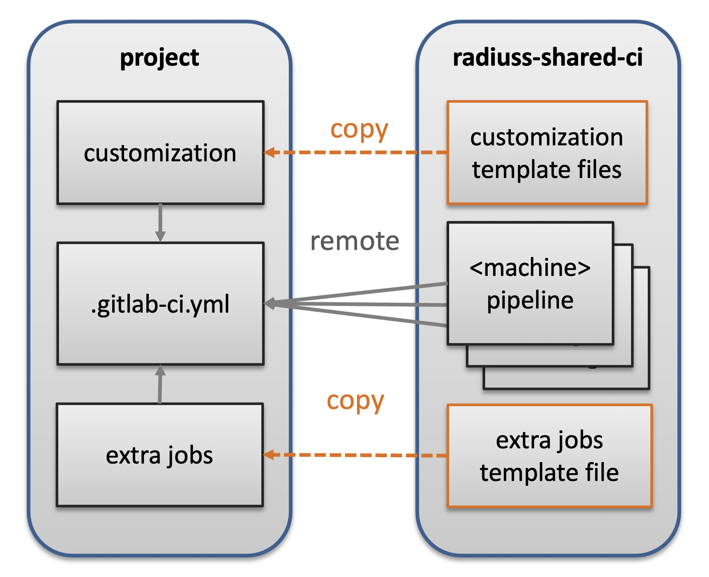

.. ##
.. ## Copyright (c) 2022, Lawrence Livermore National Security, LLC and
.. ## other RADIUSS Project Developers. See the top-level COPYRIGHT file for details.
.. ##
.. ## SPDX-License-Identifier: (MIT)
.. ##

.. _setup_ci-label:

**************************************
Setup the CI using the shared template
**************************************

.. figure:: images/SharedCI_ProjectStructure.png
   :scale: 18 %
   :align: center

   Once Spack and the build script set up, we focus of the Shared CI
   Infrastructure itself.

After completing the first two steps :ref:`use_spack-label` and
:ref:`build_and_test-label`, you should be able to use the shared CI
infrastructure. In more complex scenarios, you will always be able to use the
template as a starting point for a custom implementation.

=================
RADIUSS Shared CI
=================

By sharing the CI definition, projects share the burden of maintaining it. In
addition, with our shared CI, they also share a core set of Spack specs to
ensure that they keep running tests with similar build configurations.

With a centralized CI configuration that is shared by projects, we create an
interface between local and shared configurations. We try to keep this
interface minimal, while allowing for project-specific customization. Only a
handful of modifications are required to get the CI to work for your project,
while files in the ``customization`` directory allow for finer tuning and
extensibility.

.. note::
   GitLab allows projects to include external files to configure their CI. We
   rely on this mechanism to share most of the CI configuration among projects.

File structure
==============

   The RADIUSS Shared CI repository contains files that are used remotely as
   well as templates that needs to be copied over and completed.

The short version
=================

The following sequence of steps and commands summarizes the process of
integrating the RADIUSS Shared CI infrastructure into your project.

.. code-block:: bash

   ### Prerequisites
   # write CI script

   ### CI Setup
   cd my_project/..
   git clone https://github.com/LLNL/radiuss-shared-ci.git
   cd my_project
   cp ../radiuss-shared-ci/customization/gitlab-ci.yml .gitlab-ci.yml
   mkdir -p .gitlab
   cp ../radiuss-shared-ci/customization/subscribed-pipelines.yml .gitlab
   cp ../radiuss-shared-ci/customization/custom-jobs-and-variables.yml .gitlab
   cp ../radiuss-shared-ci/extra-jobs/*-extra.yml .gitlab
   vim .gitlab/subscription-pipelines.yml
   # comment the jobs associted to <CI_MACHINE> you don’t want.
   vim .gitlab/custom-jobs-and-variables.yml
   # set the variables according to your needs.
   vim .gitlab/*-extra.yml
   # Add jobs or override some of the shared ones.

   ### Non-RADIUSS projects
   open https://lc.llnl.gov/gitlab/<group>/<project>/-/settings/ci_cd
   # Set CI/CD variable GITHUB_TOKEN to hold token with repo:status
   # permissions.

Jump to a corresponding section for details on :ref:`customize-ci`,
:ref:`edit-extra-jobs` and :ref:`write-ci-script`.

The detailed version
====================

Our CI implementation can be divided in four parts:

* local build-and-test script
* shared files
* customization files
* extra jobs

Setting up the CI consists of four corresponding steps.

Write CI Script
---------------

The first step is to provide a CI script, which you should already have
after completing :ref:`write-ci-script` at Step 2.

Once you have that script, you are ready to move on to the CI setup.

Core CI implementation
----------------------

Start by cloning the RADIUSS Shared CI project locally, for example next to
the project you intend to add CI to.

.. code-block:: bash

   cd my_project/..
   git clone https://github.com/LLNL/radiuss-shared-ci.git
   cd my_project

By default, GitLab expects a ``.gitlab-ci.yml`` file to interpret the CI setup.
We provide one in ``customization/gitlab-ci.yml`` that projects can copy-paste.
Make sure to place the file in the top-level directory of your project, and
that it has a dot (``.``) at the beginning of the name.

.. code-block:: bash

   cp ../radiuss-shared-ci/customization/gitlab-ci.yml .gitlab-ci.yml

In the ``.gitlab-ci.yml`` file, there are some variables you need to adapt to
your project. They are described in the following table:

 ========================================== ==========================================================================================================================
  Parameter                                  Description
 ========================================== ==========================================================================================================================
  ``GITHUB_PROJECT_NAME``                    The Project name on GitHub, use to send status updates
  ``GITHUB_PROJECT_ORG``                     The Project organization on GitHub, use to send status updates
  ``LLNL_SERVICE_USER``                      Project specific Service User Account used in CI (optional but recommeded)
  ``CUSTOM_CI_BUILD_DIR``                    If not using a service user, where to locate build directories (prevent exceeding your disk quota)
  ``GIT_SUBMODULES_STRATEGY``                Controls strategy for the clone performed by GitLab. Consider ``recursive`` if you have submodules, otherwise comment it.
  ``BUILD_ROOT``                             Location (path) where the projects should be built. We provide a sensible default.
  ``BUILD_AND_TEST_CMD``                     The command that runs the build and test script. Lets you name and store that script however you like.
 ========================================== ==========================================================================================================================

.. note::
   If a variable is blank in the template file, then it does not require a
   value. If a variable has a value there (even "..."), it does require one.

.. warning::
   We strongly recommend that you set your CI to use a service user account.
   This will enable you to add users to associated service user account group
   so that they can interact with GitLab runners to restart test pipelines,
   for example.

Your CI is now set up to include remote files from the GitLab mirror of the
radiuss-shared-ci project.

Lastly, we need to complete the interface with the shared CI configuration.
In particular, the ``.gitlab-ci.yml`` file requires some files to be present
in your Git repository. These are described in the next few sections.

.. _customize-ci:

Customize CI
------------

We provide templates for the required customization files. You need to have a
``.gitlab`` subdirectory in the top-level directory of your Git repo. Then,
you can copy the template files to that directory in your repo. For example:

.. code-block:: bash

   mkdir -p .gitlab
   cp ../radiuss-shared-ci/customization/subscribed-pipelines.yml .gitlab
   cp ../radiuss-shared-ci/customization/custom-jobs-and-variables.yml .gitlab

We will now browse the files to see what changes they may require to suit your
needs.

The ``.gitlab/subscribed-pipelines.yml`` file
^^^^^^^^^^^^^^^^^^^^^^^^^^^^^^^^^^^^^^^^^^^^^^

In this file, you select the machines you want to run tests on. Comment out
the jobs (sections) for machines you don't want, or don't have access to.

.. note::
   To add a new machine, please refer to :ref:`add-a-new-machine`.

The ``.gitlab/custom-jobs-and-variables.yml`` file 
^^^^^^^^^^^^^^^^^^^^^^^^^^^^^^^^^^^^^^^^^^^^^^^^^^

Here is a table that describes each variable present in the file. More
details can be found in the file itself.

 ========================================== ==========================================================================================================================
  Parameter                                  Description
 ========================================== ==========================================================================================================================
  ``ALLOC_NAME``                             Name of the shared allocation. Should be unique, our default should be fine.
  ``<MACHINE>_BUILD_AND_TEST_SHARED_ALLOC``  Parameters for the shared allocation. You may extend the resource and time.
  ``<MACHINE>_BUILD_AND_TEST_JOB_ALLOC``     Parameters for the job allocation. You may extend the resource and time within the scope of the shared allocation.
  ``PROJECT_<MACHINE>_VARIANTS``             Global variants to be added to all the shared specs.
  ``PROJECT_<MACHINE>_DEPS``                 Global dependencies to be added to all the shared specs.
 ========================================== ==========================================================================================================================

.. note::
   If a variable is blank in the template file, then it does not require a
   value. If a variable has a value there, it does require one.

You may add configurations to the ``.custom_build_and_test`` job that will then
be included in all you CI jobs. This can be used to `export jUnit test reports`_,
for example. Changes to that section are not mandatory.

.. _edit-extra-jobs:

Edit extra jobs
---------------

We provide templates for the extra jobs files. Typically, these files are 
included in your project's ``.gitlab`` subdirectory and named 
``<platform>-build-and-test-extra.yml``, where ``platform`` is the associated
machine name. Those files are required as soon as the associated machine has 
been activated in the ``.gitlab/subscribed-pipelines`` file.

If no extra jobs are needed, for example if the shared jobs automatically 
included are sufficient, then you should add the extra jobs files as-is, with 
a simple variable definition to prevent it from being empty.

If you need to define extra jobs that are specific to your project, then you 
may remove the variable definition, uncomment the template job and complete 
it with the required information:

* A unique job name that will appear in CI.
* A Spack spec used by ``build-and-test`` to know what to build.

.. warning::
   GitLab supports long and complex job names. Make sure to pick names that
   are sufficiently unique so that your extra jobs do not override a shared job.

.. note::
   ``PROJECT_<MACHINE>_VARIANTS/DEPS`` apply to all the shared specs. If you
   want to build a spec without them, you need to define an extra job, even if
   this is a shared spec: in that case you can give the extra jobs the exact
   same name as the shared one so that the latter will be overridden.

Non-RADIUSS Projects
--------------------

RADIUSS Shared CI features a customized status report mechanism that reports to
to GitHub the CI status of each sub-pipeline (one per machine).

This feature requires the creation of a GitHub token with ``repo:status``
permissions, and registering it as a CI/CD variable named ``GITHUB_TOKEN`` in
the project (or the group) on GitLab.

Visit ``https://lc.llnl.gov/gitlab/<group>/<project>/-/settings/ci_cd`` to
create the variable once the token has been generated on GitHub.

.. _Radiuss Shared CI: https://radiuss-shared-ci.readthedocs.io/en/latest/index.html
.. _export jUnit test reports: https://github.com/LLNL/Umpire/blob/develop/.gitlab/custom-jobs-and-variables.yml
.. _sharing spack configuration files: https://github.com/LLNL/radiuss-spack-configs
