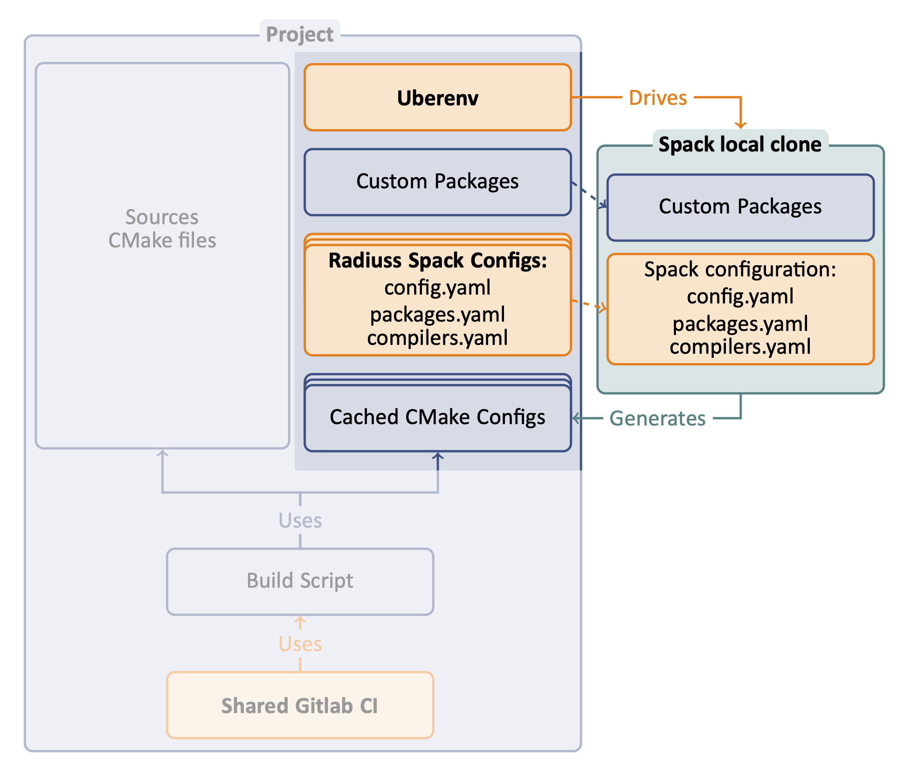

.. ##
.. ## Copyright (c) 2022, Lawrence Livermore National Security, LLC and
.. ## other RADIUSS Project Developers. See the top-level COPYRIGHT file for details.
.. ##
.. ## SPDX-License-Identifier: (MIT)
.. ##

.. _use_spack-label:

****************************************
Use Spack to configure the project build
****************************************

The first step in adopting RADIUSS CI infrastructure is to setup your project
so that Spack can be used to install the dependencies and generate a
configuration file for the build.

The end product should be a script that takes a Spack spec as an input, and
returns the configuration file generated by Spack after installing the
dependencies for the given spec.

Spack provides a single context to express *toolchains*, *machines setup* and
*build sequence*. Using it will allow us to share configuration files to
describe the toolchains and machines setup. `Radiuss-Spack-Configs`_ is the
repository where RADIUSS projects Spack configuration is shared.

Spack is increasingly used to install the dependency tree of
large simulation codes. As such, it makes sense to use Spack early in the
development process.

.. note::
   We are not promoting a "Spack everywhere" strategy. But we advocate that
   Spack should be *one of the ways* to configure and build your projects,
   since you projects will likely be built that way in production someday.

We rely on `Uberenv`_ to facilitate the setup of a local and isolated spack
instance that will be used to build the project dependencies. We strongly
suggest that you start with Uberenv to benefit from a reliable Spack usage in
your CI (tried and tested) and keep the configuration script simple.

=============
Uberenv Guide
=============

The role of Uberenv will be to manage the setup of your Spack instance and then
drive Spack to install your project dependencies and generate the
configuration file.

.. note::
   Uberenv will create a directory ``uberenv_libs`` containing a Spack
   instance with the required project dependencies installed. It then
   generates a CMake configuration file (``<config_dependent_name>.cmake``)
   at the root of the project repository.

   One common source of error when using Uberenv is when the ``uberenv_libs``
   folder is out of date. To resolve, make sure this folder is deleted before
   running new scripts for the first time because this folder needs to be
   regenerated.

Getting Uberenv by clone/fetch/copy
===================================

1. Get uberenv.py script.

    Clone/Fetch/Copy it from `Uberenv`_ repository.
    into a ``uberenv`` directory, not as a submodule.

2. Edit uberenv/project.json.

    Set your project package name, and other parameters like Spack reference
    commit/tag (we suggest the latest release tag).

3. Add radiuss-spack-configs submodule.

    * Use ``git submodule add`` to get `Radiuss_Spack_Configs`_.

    * Create a symlink ``uberenv/spack_configs`` that points to
      ``radiuss-spack-configs``.

4. Add custom packages.

    | If you need to make local modifications to your project package or a
      dependency package, you may put it in a corresponding directory:
    | ``uberenv/packages/<package_name>/package.py``.

5. Make sure that <project>/package.py generates a host-config cmake file.

    This is usually done adding a specific stage to the package (see for example
    the hostconfig stage in Umpire, CHAI, etc.).

Getting Uberenv as a submodule
==============================

1. Get uberenv.py script.

    Use ``git submodule add`` to get `Uberenv`_ into a ``uberenv`` directory.

2. Edit .uberenv.json.

    Create ``.uberenv.json`` in a directory that is a parent of ``uberenv``. Set
    your project package name, and other parameters like Spack reference
    commit/tag (we suggest the latest release tag).

3. Add radiuss-spack-configs submodule.

    * Use ``git submodule add`` to get `Radiuss-Spack-Configs`_ in a second
      submodule or custom location.

    * In ``.uberenv.json`` set ``spack_configs_path`` to point to
      ``<some_path>/radiuss-spack-configs``.

4. Add custom packages.

    * | If you need to make local modifications to your project package or a
        dependency package, you may put it in a corresponding directory:
      | ``<some_path>/packages/<package_name>/package.py``.

    * In ``.uberenv.json`` set ``spack_packages_path`` to point to
      ``<some_path>/packages``

5. Make sure that <project>/package.py generates a host-config cmake file.

    This is usually done adding a specific stage to the package (see for example
    the hostconfig stage in Umpire, CHAI, etc.).

==================================
Get the shared Spack configuration
==================================

We share Spack configuration files in `Radiuss_Spack_Configs`_. In this repo
you will find:

* `config.yaml` for Spack general configuration.
* `modules.yaml` for modules creation by Spack.
* One `compilers.yaml` and `packages.yaml` per system type, describing the
  installed toolchain on each machine.

Depending on the machine/system, we may or may not provide a spack
configuration allowing you to use it right away. Please refer to
`Radiuss_Spack_Configs`_ documentation about adding a new machine. This will be
welcome by the RADIUSS teams using it!

.. note:: MacOS (darwin) case
   It is not trivial to provide a universal configuration for MacOS.  Instead,
   the developer will likely have to complete the ``packages.yaml`` file in
   order to adapt the location and version of externally installed
   dependencies. MacOS is not available on LC systems, the Spack configuration
   is provided as-is, for development use.

=========================================================
Setup your Spack package to generate a configuration file
=========================================================

We want to build the dependencies with Spack and then build the project with
those dependencies but outside of Spack. We need to generate a CMake
configuration file that reproduces the configuration `Spack`_ would have
generated in the same context. It should contain all the information necessary
to build your project with the described toolchain and dependencies.

In particular, the configuration file should setup:

* flags corresponding with the target required (Release, Debug).
* compilers path, and other toolkits (cuda if required), etc.
* paths to installed dependencies.
* any option that may have an impact on your build.

This provides an easy way to build your project based on `Spack`_ configuration
while only using CMake and a traditionnal developer workflow.

CMake projects: Spack CachedCMakePackage
========================================

The use of a CMake build system is strongly recommended to adopt RADIUSS CI
workflow, that's because of this step. With CMake, we can generate a cache file
with all the configuration necessary to trigger a build later on. This is
supported in Spack as soon as your package inherits from
``CachedCMakePackage``.

Once your package has been ported, stopping the Spack install after
``initconfig`` phase will prevent it from building your project and the CMake
configuration file will have been generated already.

Non-CMake projects: Custom implementation
=========================================

The only example of a non-CMake project that adopted this workflow is MFEM.
Altough it is using a Makefile build system in its Spack Packages, MFEM is
generating a configuration file that can be used just like a CMake configuraton
file. We adapted the implementation of the package to mimics the mechanism
available in CMake-based packages. You may use that as an example.

.. _Radiuss-Spack-Configs: https://github.com/LLNL/radiuss-spack-configs
.. _Uberenv: https://github.com/LLNL/uberenv
.. _Spack: https://github.com/spack/spack
